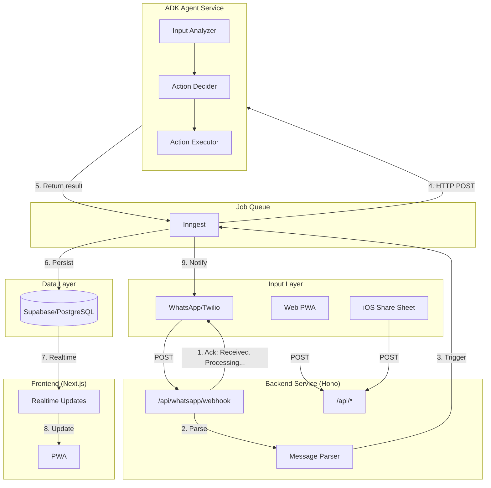

# LifeOS Re-Architecture Plan

> **Goal**: Transform the codebase into a clean, productizable monorepo with clear separation between frontend, backend, and AI services.

> **Main Branch**: `lifeos-refactor`
> **Documentation**: `REFACTOR.md` (kept in sync with this plan)

## Executive Summary

This plan restructures LifeOS from a mixed Next.js application into a **production-ready monorepo** with:
- `/frontend` - Next.js 15 web application (no API routes)
- `/backend` - Hono API services, Inngest job orchestration
- `/services/adk-agent` - Google ADK AI microservice with clear HTTP contract
- `/packages/shared` - Types, contracts, utilities shared across services
- Docker Compose deployment for any cloud platform

**Key Insight**: The ADK agent orchestrator already exists (932 lines at `lib/services/ai/agents/orchestrator.ts`). This plan focuses on **extraction and separation**, not reimplementation.

---

## Code Quality Standards

### Principles
- **Clean code over comments** - Code should be self-documenting
- **Meaningful logs only** - Log business events, not noise
- **No over-commenting** - Comments explain "why", not "what"
- **Consistent patterns** - Follow established patterns in each service

### Logging Guidelines
```typescript
// GOOD - Business event with context
logger.info('Processing WhatsApp message', { userId, messageType, jobId });
logger.info('ADK processing complete', { jobId, durationMs, tokensUsed });

// BAD - Noise
logger.debug('Entering function processMessage');
logger.debug('Variable x = 5');
```

### File Organization
- One concept per file
- Clear barrel exports (`index.ts`)
- Types co-located with implementation or in shared package

---

## Parallel Execution Strategy

### Branch Structure
```
main
└── lifeos-refactor (integration branch)
    ├── feat/refactor-monorepo-setup (Agent A)
    ├── feat/refactor-packages-shared (Agent B)
    ├── feat/refactor-packages-db (Agent C)
    ├── feat/refactor-backend-core (Agent D)
    ├── feat/refactor-backend-whatsapp (Agent E)
    ├── feat/refactor-backend-inngest (Agent F)
    ├── feat/refactor-adk-service (Agent G)
    └── feat/refactor-frontend-cleanup (Agent H)
```

### Merge Order (Dependencies)
```
Phase 1 (Parallel - No Dependencies):
  A: monorepo-setup ─────┐
  B: packages-shared ────┼──▶ Merge to lifeos-refactor
  C: packages-db ────────┘

Phase 2 (After Phase 1):
  D: backend-core ───────┐
  E: backend-whatsapp ───┼──▶ Merge to lifeos-refactor
  F: backend-inngest ────┘

Phase 3 (After Phase 2):
  G: adk-service ────────┬──▶ Merge to lifeos-refactor
  H: frontend-cleanup ───┘

Phase 4 (After Phase 3):
  Docker + CI/CD (single agent)
```

---

## Work Items for Parallel Execution

### ITEM-A: Monorepo Setup
**Branch**: `feat/refactor-monorepo-setup`
**Dependencies**: None
**Estimated**: 1-2 hours

**Tasks**:
- [ ] Create `pnpm-workspace.yaml`
- [ ] Create `turbo.json` with build/dev/lint pipelines
- [ ] Create root `package.json` with workspace scripts
- [ ] Create root `tsconfig.json` with path aliases
- [ ] Create `.npmrc` for pnpm settings
- [ ] Update `.gitignore` for monorepo structure
- [ ] Create placeholder directories: `packages/`, `frontend/`, `backend/`, `services/`

**Output Files**:
```
pnpm-workspace.yaml
turbo.json
package.json
tsconfig.json
.npmrc
```

---

### ITEM-B: Packages - Shared Types & Contracts
**Branch**: `feat/refactor-packages-shared`
**Dependencies**: None (can start immediately)
**Estimated**: 2-3 hours

**Tasks**:
- [ ] Create `packages/shared/package.json`
- [ ] Create `packages/shared/tsconfig.json`
- [ ] Create ADK contracts with Zod: `src/contracts/adk.ts`
- [ ] Create item contracts: `src/contracts/items.ts`
- [ ] Create job contracts: `src/contracts/jobs.ts`
- [ ] Create WhatsApp contracts: `src/contracts/whatsapp.ts`
- [ ] Create shared types: `src/types/index.ts`
- [ ] Create shared utils: `src/utils/index.ts`
- [ ] Create barrel export: `src/index.ts`

**Key Contracts**:
```typescript
// ADK Request/Response (Zod validated)
// Item CRUD types
// Job status types
// WhatsApp message types
```

---

### ITEM-C: Packages - Database Client
**Branch**: `feat/refactor-packages-db`
**Dependencies**: None (can start immediately)
**Estimated**: 2 hours

**Tasks**:
- [ ] Create `packages/db/package.json`
- [ ] Create `packages/db/tsconfig.json`
- [ ] Create Supabase client factory: `src/client.ts`
- [ ] Generate DB types from Supabase: `src/types.ts`
- [ ] Create query helpers: `src/queries/items.ts`, `src/queries/jobs.ts`
- [ ] Move migrations reference: `src/migrations/` (symlink to supabase/)
- [ ] Create barrel export: `src/index.ts`

**Output Files**:
```
packages/db/
├── package.json
├── tsconfig.json
└── src/
    ├── client.ts
    ├── types.ts
    ├── queries/
    │   ├── items.ts
    │   ├── jobs.ts
    │   └── index.ts
    └── index.ts
```

---

### ITEM-D: Backend - Core Setup
**Branch**: `feat/refactor-backend-core`
**Dependencies**: ITEM-A, ITEM-B, ITEM-C
**Estimated**: 3-4 hours

**Tasks**:
- [ ] Create `backend/package.json` with Hono, zod dependencies
- [ ] Create `backend/tsconfig.json`
- [ ] Create Hono app entry: `src/index.ts`
- [ ] Create middleware: `src/middleware/auth.ts`, `src/middleware/cors.ts`
- [ ] Create health endpoint: `src/api/health/index.ts`
- [ ] Create items CRUD routes: `src/api/items/index.ts`
- [ ] Create jobs routes: `src/api/jobs/index.ts`
- [ ] Create logger utility: `src/utils/logger.ts`
- [ ] Create `Dockerfile` and `Dockerfile.dev`

**Output Files**:
```
backend/
├── package.json
├── tsconfig.json
├── Dockerfile
├── Dockerfile.dev
└── src/
    ├── index.ts
    ├── middleware/
    │   ├── auth.ts
    │   ├── cors.ts
    │   └── index.ts
    ├── api/
    │   ├── health/index.ts
    │   ├── items/index.ts
    │   └── jobs/index.ts
    └── utils/
        └── logger.ts
```

---

### ITEM-E: Backend - WhatsApp Webhook
**Branch**: `feat/refactor-backend-whatsapp`
**Dependencies**: ITEM-D
**Estimated**: 4-5 hours

**Tasks**:
- [ ] Create webhook handler: `src/api/whatsapp/webhook.ts`
- [ ] Create Twilio signature validation: `src/services/whatsapp/validate.ts`
- [ ] Create message parser: `src/services/whatsapp/parser.ts`
- [ ] Create message sender: `src/services/whatsapp/sender.ts`
- [ ] Create response formatter: `src/services/whatsapp/formatter.ts`
- [ ] Implement immediate ack pattern: "Received. Processing..."
- [ ] Create link endpoint: `src/api/whatsapp/link.ts`
- [ ] Add logging for key events only

**Immediate Ack Pattern**:
```typescript
// Return "Received. Processing..." within 500ms
// Trigger Inngest job asynchronously
// Don't block on DB operations for the ack
```

---

### ITEM-F: Backend - Inngest Integration
**Branch**: `feat/refactor-backend-inngest`
**Dependencies**: ITEM-D
**Estimated**: 4-5 hours

**Tasks**:
- [ ] Create Inngest client: `src/inngest/client.ts`
- [ ] Create Inngest serve middleware: `src/inngest/handler.ts`
- [ ] Create process job function: `src/inngest/functions/process-content.ts`
- [ ] Create notification function: `src/inngest/functions/send-notification.ts`
- [ ] Wire Inngest to Hono app
- [ ] Implement ADK service HTTP call pattern
- [ ] Add step-level error handling
- [ ] Add meaningful logging at job boundaries

**Key Pattern**:
```typescript
// Inngest function calls ADK service via HTTP
// Each step is durable and retryable
// Log job start, ADK call, completion
```

---

### ITEM-G: ADK Agent Service
**Branch**: `feat/refactor-adk-service`
**Dependencies**: ITEM-B
**Estimated**: 5-6 hours

**Tasks**:
- [ ] Create `services/adk-agent/package.json`
- [ ] Create `services/adk-agent/tsconfig.json`
- [ ] Extract orchestrator from `lib/services/ai/agents/orchestrator.ts`
- [ ] Extract config from `lib/services/ai/agents/config.ts`
- [ ] Move agent implementations: `input-analyzer/`, `action-decider/`, `action-executor/`
- [ ] Move tools: `tools/vision.ts`, `tools/transcription.ts`, etc.
- [ ] Create HTTP server: `src/server.ts` with Hono
- [ ] Create `/process` endpoint
- [ ] Create `/health` and `/ready` endpoints
- [ ] Create `Dockerfile` and `Dockerfile.dev`
- [ ] Add Langfuse tracing at agent boundaries

**Output Structure**:
```
services/adk-agent/
├── package.json
├── tsconfig.json
├── Dockerfile
└── src/
    ├── server.ts
    ├── orchestrator.ts
    ├── config.ts
    ├── agents/
    │   ├── input-analyzer/
    │   ├── action-decider/
    │   └── action-executor/
    └── tools/
```

---

### ITEM-H: Frontend Cleanup
**Branch**: `feat/refactor-frontend-cleanup`
**Dependencies**: ITEM-D (backend must exist to point to)
**Estimated**: 4-5 hours

**Tasks**:
- [ ] Create `frontend/package.json` (move from root)
- [ ] Create `frontend/tsconfig.json`
- [ ] Move `src/` to `frontend/src/`
- [ ] Delete all `frontend/src/app/api/` routes
- [ ] Create API client: `frontend/src/lib/api.ts`
- [ ] Update all fetch calls to use `NEXT_PUBLIC_API_URL`
- [ ] Update imports to use `@lifeos/shared`, `@lifeos/db`
- [ ] Create `Dockerfile` and `Dockerfile.dev`
- [ ] Test build without API routes

**API Client Pattern**:
```typescript
// frontend/src/lib/api.ts
export async function apiClient(path: string, options?: RequestInit) {
  const session = await getSession();
  return fetch(`${process.env.NEXT_PUBLIC_API_URL}${path}`, {
    ...options,
    headers: {
      'Authorization': `Bearer ${session?.access_token}`,
      'Content-Type': 'application/json',
    },
  });
}
```

---

### ITEM-I: Docker & CI/CD
**Branch**: `feat/refactor-docker-cicd`
**Dependencies**: All above items
**Estimated**: 3-4 hours

**Tasks**:
- [ ] Create `docker-compose.yml` for production
- [ ] Create `docker-compose.dev.yml` for local development
- [ ] Create GitHub Actions workflow: `.github/workflows/build.yml`
- [ ] Create GitHub Actions workflow: `.github/workflows/deploy.yml`
- [ ] Update root README.md
- [ ] Verify full stack starts with `docker-compose up`

---

## Agent Instructions Template

When assigning work to a Claude instance, use this template:

```
## Assignment: ITEM-X - [Name]
Branch: feat/refactor-[name]
Base: lifeos-refactor

### Context
Read REFACTOR.md for full architecture context.
Your work item is ITEM-X.

### Tasks
[Copy tasks from above]

### Code Quality Rules
1. Clean code over comments - code should be self-documenting
2. Log only business events: job start, completion, errors
3. Follow existing patterns in the codebase
4. Use Zod for all external API validation
5. One concept per file, clear barrel exports

### When Done
1. Run `pnpm lint` and `pnpm typecheck`
2. Commit with: `feat(refactor): [item description]`
3. Push branch and open PR to lifeos-refactor
4. Mark tasks complete in REFACTOR.md
```

---

## Target Architecture

```
lifeos/
├── packages/
│   ├── shared/                    # Shared types, utils, contracts
│   │   ├── src/
│   │   │   ├── types/
│   │   │   ├── contracts/
│   │   │   └── utils/
│   │   └── package.json
│   │
│   └── db/                        # Database client & types
│       ├── src/
│       │   ├── client.ts
│       │   ├── types.ts
│       │   └── queries/
│       └── package.json
│
├── frontend/                      # Next.js 15 Web Application
│   ├── src/
│   │   ├── app/                  # Pages only (NO api routes)
│   │   ├── components/
│   │   ├── hooks/
│   │   └── contexts/
│   ├── Dockerfile
│   └── package.json
│
├── backend/                       # Hono API & Orchestration
│   ├── src/
│   │   ├── api/
│   │   │   ├── whatsapp/
│   │   │   ├── items/
│   │   │   ├── jobs/
│   │   │   └── health/
│   │   ├── services/
│   │   ├── inngest/
│   │   └── index.ts
│   ├── Dockerfile
│   └── package.json
│
├── services/
│   └── adk-agent/                 # Google ADK AI Microservice
│       ├── src/
│       │   ├── agents/
│       │   ├── tools/
│       │   ├── orchestrator.ts
│       │   └── server.ts
│       ├── Dockerfile
│       └── package.json
│
├── docker-compose.yml
├── docker-compose.dev.yml
├── turbo.json
├── pnpm-workspace.yaml
├── REFACTOR.md
└── package.json
```

---

## High-Level Flow Diagram



---

## ADK Service Contract

### Request Schema
```typescript
// packages/shared/src/contracts/adk.ts
export const ADKProcessRequestSchema = z.object({
  requestId: z.string().uuid(),
  jobId: z.string().uuid().optional(),
  content: z.object({
    type: z.enum(['text', 'url', 'image', 'audio']),
    text: z.string().optional(),
    mediaUrl: z.string().url().optional(),
    caption: z.string().optional(),
  }),
  userId: z.string().uuid(),
  itemId: z.string().uuid().optional(),
  source: z.enum(['whatsapp', 'web', 'share', 'api']).default('api'),
  hints: z.object({
    skipWebSearch: z.boolean().default(false),
    skipEmbedding: z.boolean().default(false),
    prioritize: z.enum(['speed', 'quality']).default('quality'),
  }).optional(),
});
```

### Response Schema
```typescript
export const ADKProcessResponseSchema = z.object({
  requestId: z.string().uuid(),
  success: z.boolean(),
  result: z.object({
    analysis: z.object({
      title: z.string(),
      summary: z.string(),
      contentType: z.string(),
      confidence: z.number().min(0).max(1),
      topics: z.array(z.string()),
    }),
    actions: z.array(z.object({
      agent: z.string(),
      action: z.string(),
      status: z.enum(['completed', 'skipped', 'failed']),
    })),
    item: z.object({
      title: z.string(),
      content: z.string(),
      category: z.string(),
      tags: z.array(z.string()),
      enrichment: z.record(z.unknown()),
    }).optional(),
  }).optional(),
  meta: z.object({
    processingTimeMs: z.number(),
    agentsInvoked: z.array(z.string()),
  }),
  error: z.string().optional(),
});
```

---

## Verification Checklist

### After Phase 1 (Items A, B, C)
- [ ] `pnpm install` works from root
- [ ] `pnpm build` builds all packages
- [ ] `@lifeos/shared` exports contracts
- [ ] `@lifeos/db` exports client

### After Phase 2 (Items D, E, F)
- [ ] Backend starts: `pnpm --filter backend dev`
- [ ] Health check: `curl localhost:4000/health`
- [ ] Inngest dev server connects
- [ ] WhatsApp webhook returns in < 500ms

### After Phase 3 (Items G, H)
- [ ] ADK service starts: `pnpm --filter adk-agent dev`
- [ ] Frontend builds without API routes
- [ ] Frontend connects to backend

### After Phase 4 (Item I)
- [ ] `docker-compose up` starts everything
- [ ] Full WhatsApp flow works end-to-end
- [ ] CI/CD pipeline passes

---

## Progress Tracking

### Phase 1: Foundation
| Item | Branch | Status | Agent | PR |
|------|--------|--------|-------|-----|
| A: Monorepo Setup | `feat/refactor-monorepo-setup` | ⬜ Not Started | - | - |
| B: Packages Shared | `feat/refactor-packages-shared` | ⬜ Not Started | - | - |
| C: Packages DB | `feat/refactor-packages-db` | ⬜ Not Started | - | - |

### Phase 2: Backend
| Item | Branch | Status | Agent | PR |
|------|--------|--------|-------|-----|
| D: Backend Core | `feat/refactor-backend-core` | ⬜ Not Started | - | - |
| E: Backend WhatsApp | `feat/refactor-backend-whatsapp` | ⬜ Not Started | - | - |
| F: Backend Inngest | `feat/refactor-backend-inngest` | ⬜ Not Started | - | - |

### Phase 3: Services
| Item | Branch | Status | Agent | PR |
|------|--------|--------|-------|-----|
| G: ADK Service | `feat/refactor-adk-service` | ⬜ Not Started | - | - |
| H: Frontend Cleanup | `feat/refactor-frontend-cleanup` | ⬜ Not Started | - | - |

### Phase 4: Deployment
| Item | Branch | Status | Agent | PR |
|------|--------|--------|-------|-----|
| I: Docker & CI/CD | `feat/refactor-docker-cicd` | ⬜ Not Started | - | - |

---

## Status Legend
- ⬜ Not Started
- 🔵 In Progress
- ✅ Complete
- 🔴 Blocked
